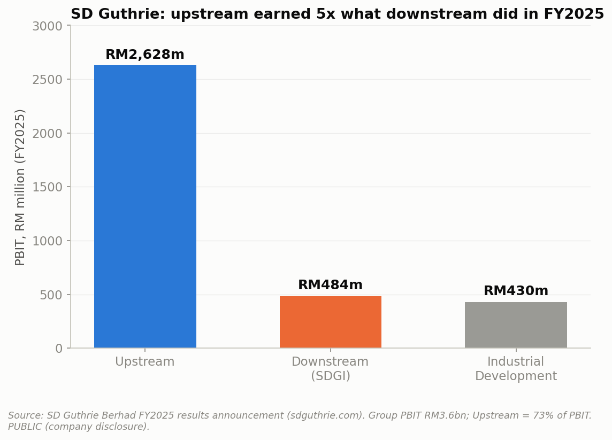

# Project 009: Malaysia's Palm Oil

### Value Chain, Crisis, and What's Next



**Part of a [10-case-study portfolio](https://github.com/ooi-darren)**, and the first to build its core financial analysis on company annual-report disclosures rather than government/agency statistics alone.

> Malaysia can't out-produce Indonesia on scale anymore. This project asks what else it can compete on: efficiency, certification, downstream value, or an entirely new product, and tests each claim against real data rather than assuming the answer.

## Recommendation

**Malaysia should stop measuring its palm oil strategy against Indonesia's production volume and start measuring it against value captured per tonne, because the data shows Malaysia has already lost the volume race for good (structurally out-landed 2.8-to-1) while still holding a real, under-exploited efficiency edge (higher yield per hectare) and a live, plausible new value-capture lever (Sawit EcoTherm) that Indonesia has no equivalent to yet.** Certification (MSPO) and downstream diversification, the two strategies most already invested in, show real but modest payoffs so far, market access rather than price premium for certification, and a mixed, company-specific record for downstream, not the clean win the "move up the value chain" narrative implies. The Key Strategic Insights section below works through the evidence for each of these findings.

## Executive Summary

This project traces Malaysia's palm oil industry from its 1917 origin as a French planter's experiment through its current position as one half of a global duopoly, into where its money actually goes today, and what a live global shock is doing to the numbers right now. Indonesia and Malaysia together produce 83% of the world's palm oil (FAOSTAT, 2023), but Indonesia overtook Malaysia in total output in 2007 and has pulled to more than double Malaysia's volume since, driven by a 2.8x larger harvested area, not better farming: Malaysia's yield per hectare has generally run higher than Indonesia's over the past decade. On margin capture, SD Guthrie Berhad's FY2025 results show upstream earning roughly 5x what its downstream arm did (RM2.63bn vs RM484m PBIT), but checking this against Malaysia's other major listed plantation companies shows the downstream picture is not uniform: KLK's and SD Guthrie's downstream results improved while IOI's and Genting Plantations' declined, a company-specific story, not an industry-wide downstream failure. On certification, MSPO adoption has tripled since becoming mandatory in 2020 (24% to 85% of independent smallholders), and the EU's September 2025 recognition of MSPO toward its deforestation regulation gives it real market-access value, though no public data confirms a price premium for certified oil, a limitation this project discloses rather than papers over. On price, Malaysia's palm oil price has moved with crude oil for a decade (r=0.63, 2015-2025) through the palm-oil-to-biodiesel substitution mechanism, and the 2026 Iran war's oil supply shock, the largest in the history of the global oil market per the IEA, is reported by trade press to have compressed that relationship to a 41-month extreme. Looking forward, the OECD-FAO Agricultural Outlook has downgraded palm oil's global growth forecast from 1.3%/year to 0.8%/year as land constraints bite in both producing countries, while MPOB's August 2026 announcement of Sawit EcoTherm, a palm oil-based cooling fluid for AI data centers, is a genuine, if still unproven, bet on an entirely new demand category.

## Research Question

**Where does the money actually go in Malaysia's palm oil value chain, and is the country's push beyond raw production, into certification, downstream processing, and now entirely new products, actually paying off?**

## Key Findings

**1. Indonesia and Malaysia produce 83% of the world's palm oil, and that duopoly is expected to hold through 2035.** No other country produces even a tenth of what Malaysia does; the OECD-FAO Agricultural Outlook still projects the pair exporting more than 60% of global supply through 2035, even as overall growth slows.

**2. Malaysia lost the production race in 2007, but on land, not efficiency.** Indonesia's harvested area grew from 4.9M to 14.3M hectares (2010-2024) while Malaysia's stayed flat near 5.1M hectares; on a per-hectare basis, Malaysia's yield has generally run higher than Indonesia's over the same period.

**3. Upstream earned roughly 5x what downstream did at Malaysia's largest plantation group in FY2025, but that's not the whole industry's story.** SD Guthrie's group PBIT was 73% upstream, 13% downstream; checked against IOI, KLK, and Genting Plantations, downstream performance is genuinely mixed across the sector, not uniformly weak.

**4. MSPO certification adoption tripled since 2020, but this project could not confirm a price premium.** Independent smallholder certification rose from 24.3% (2020) to 85% (2026); the concrete, confirmed payoff found is market access (the EU's Sept 2025 EUDR recognition, EFTA tariff preference), not a demonstrated higher sale price.

**5. Palm oil price has tracked crude oil for a decade, and a live global shock is testing that link right now.** r=0.63 correlation (2015-2025, World Bank data); the 2026 Iran war's oil supply disruption, the largest on record per the IEA, is reported to have pushed the palm-oil/gas-oil substitution economics to a 41-month extreme.

**6. Growth is slowing by the industry's own official forecast, and Malaysia's newest bet has nothing to do with food or fuel.** OECD-FAO's growth projection fell from 1.3%/year to 0.8%/year across successive outlook editions; MPOB's August 2026 Sawit EcoTherm (a palm oil-based AI data center cooling fluid) is a real, disclosed, but still pre-commercial attempt at a fifth downstream product category.

## Explain It Simply

Palm oil isn't native to Malaysia. A French planter brought it from West Africa in 1917, and the government later used it to fight rural poverty through land schemes starting in 1961. That history built the world's biggest palm oil industry, until Indonesia, with far more land, took the top spot in 2007 and never gave it back. This project asks: if Malaysia can't win on sheer volume anymore, what can it actually compete on?

Four things this project found:

- **Malaysia is more efficient, not less capable.** Hectare for hectare, Malaysia gets more fruit out of its land than Indonesia does; it's just run out of room to plant more of it.
- **"Going downstream" (into refining and chemicals) hasn't clearly paid off yet.** At Malaysia's biggest plantation company, the traditional business of just growing and selling raw palm fruit made about five times more money in 2025 than all its downstream processing combined, though other big companies actually did better downstream, so it's not a universal rule.
- **Certification is now the price of admission, not a bonus.** Almost all Malaysian smallholders are certified sustainable now, but we couldn't find solid evidence it earns a higher price. What it does earn is continued access to markets like the EU.
- **A war on the other side of the world is moving palm oil prices right now.** Because palm oil can be turned into diesel, its price tracks oil prices, and 2026's oil crisis, triggered by a war involving Iran, is a live test of that link happening as this project was written.

(New to terms like "PBIT," "MSPO," or "POGO spread"? See the Glossary near the bottom.)

## Why This Research Matters

Malaysia's palm oil strategy is often discussed in slogans, "move up the value chain," "get certified," "diversify downstream," without checking whether those moves are actually paying off in the numbers. This project tests each claim against real production, trade, and company-financial data, discloses plainly where the evidence is thin (the certification price premium, the 2026-specific price data), and follows the same PUBLIC/DERIVED/ESTIMATED sourcing discipline as every other case study in this portfolio.

## Value Chain: From Fruit to Five Product Categories

Fresh fruit bunch (FFB) is milled within 24-48 hours into crude palm oil (CPO) and palm kernel oil (PKO), then refined into food products, oleochemicals (soaps, cosmetics), biodiesel, and animal feed. As of August 2026, there's a fifth category too: AI data-center cooling fluid. Full walkthrough: `notebooks/01_history_and_origins.ipynb`.

## Global Landscape & Competitive Position

Indonesia and Malaysia's 83% combined share of global production, the 2007 overtake, and the land-vs-yield divergence between them are covered in `notebooks/02_global_landscape.ipynb` and `notebooks/03_malaysia_vs_indonesia.ipynb` (Visualisations 2-5).

## Margin Capture

SD Guthrie Berhad's FY2025 segment PBIT, cross-checked against IOI Corporation, KLK, and Genting Plantations' reported directional performance, in `notebooks/04_margin_capture.ipynb` (Visualisation 6). This is the first notebook in this portfolio built primarily on company financial disclosures (DERIVED) rather than government statistics (PUBLIC).

## Certification

MSPO adoption trend and the Sept 2025 EU/EUDR recognition event, with the price-premium claim explicitly tested and not confirmed, in `notebooks/05_certification_premium.ipynb` (Visualisation 7).

## Price, Demand & the 2026 Oil Crisis

The historical Brent-crude/palm-oil correlation (r=0.63, World Bank data) and the 2026 Iran war's reported effect on palm-oil-biodiesel substitution economics, plus import concentration among the top five buyers, in `notebooks/06_price_and_demand_shock.ipynb` (Visualisations 8-9). One data-licensing constraint is disclosed here: an earlier draft used a third-party site's redistributed MPOB data, found on review to be against that site's terms, and replaced with World Bank CC BY 4.0 data before publication.

## Future Outlook

OECD-FAO's downgraded growth forecast (1.3% to 0.8%/year) and MPOB's Sawit EcoTherm palm-oil-based AI data center cooling fluid, explicitly flagged as pre-commercial, in `notebooks/07_future_outlook.ipynb` (Visualisation 10).

## Key Strategic Insights

### Insight 1: Malaysia's competitive problem is land, not capability

**DATA:** Indonesia's harvested area grew 2.8x (2010-2024) while Malaysia's stayed flat; Malaysia's yield per hectare has generally exceeded Indonesia's over the same period.

**INSIGHT:** A volume-based comparison makes Malaysia look like it's falling behind; an efficiency-based comparison shows a country that's actually good at what it does, but has run out of room to do more of it.

**BUSINESS IMPLICATION:** An investor or buyer evaluating Malaysia purely on production growth would misread it as a declining supplier; the more accurate read is a mature, efficient, land-constrained one.

**STRATEGIC CONSIDERATION:** Malaysia's own strategy should stop implicitly competing on volume and lead with efficiency and quality, since that is the dimension the data actually supports.

### Insight 2: Downstream diversification is a company-specific bet, not a proven industry-wide strategy

**DATA:** SD Guthrie's downstream PBIT (RM484m) was a fraction of its upstream (RM2.63bn) in FY2025; KLK's and SD Guthrie's downstream results improved over the same period while IOI's and Genting Plantations' declined.

**INSIGHT:** "Move downstream" is not a strategy that pays off uniformly; execution and product mix matter more than the general direction.

**BUSINESS IMPLICATION:** A blanket policy push toward downstream investment, without regard to which company or product line, risks funding the weaker bets alongside the stronger ones.

**STRATEGIC CONSIDERATION:** Government and industry support for downstream diversification should be evaluated company-by-company and product-line-by-product-line, not treated as a single uniform lever.

### Insight 3: Certification has become a market-access requirement, not a price lever

**DATA:** MSPO adoption tripled since 2020 (24.3% to 85%); no public data confirms a certified-vs-uncertified price premium; the EU's Sept 2025 recognition and EFTA tariff preference are the concrete, confirmed benefits found.

**INSIGHT:** The industry sold certification internally on cost-of-compliance grounds and it may be delivering a different kind of value than expected, avoided exclusion rather than an earned premium.

**BUSINESS IMPLICATION:** A producer weighing certification costs against an expected price premium is asking the wrong question; the right question is what markets become unreachable without it.

**STRATEGIC CONSIDERATION:** Future certification-scheme communication should be honest that the payoff is access, not price, to set realistic expectations for smallholders bearing the compliance cost.

## Methodology

Full sourcing discipline follows this portfolio's standing convention: every figure classified PUBLIC / DERIVED / ESTIMATED, government/agency statistics preferred over third-party redistributions, and company-financial figures (DERIVED) used sparingly and cited per report. A data-licensing issue found and corrected during this project (a third-party site's data-reuse restriction) is disclosed in `notebooks/06_price_and_demand_shock.ipynb` rather than omitted.

## Data Sources

FAOSTAT (CC BY 4.0), World Bank Commodity Markets "Pink Sheet" (CC BY 4.0), EIA Brent crude prices via github.com/datasets/oil-prices (US public domain + PDDL), SD Guthrie / IOI Corporation / KLK / Genting Plantations FY2025 financial disclosures, MPOB/MPOC/BPS (Statistics Indonesia) via news reporting, OECD-FAO Agricultural Outlook 2026-2035. Full inline citations in each notebook.

## Notebooks

| # | Question | Data Rigor |
|---|---|---|
| [01: History & Origins](./notebooks/01_history_and_origins.ipynb) | How did palm oil become Malaysia's story? | PUBLIC |
| [02: Global Landscape](./notebooks/02_global_landscape.ipynb) | Who grows palm oil globally, and why just two countries? | PUBLIC |
| [03: Malaysia vs. Indonesia](./notebooks/03_malaysia_vs_indonesia.ipynb) | Is Malaysia losing on land, efficiency, or both? | PUBLIC |
| [04: Margin Capture](./notebooks/04_margin_capture.ipynb) | Where does the money actually go? | PUBLIC + DERIVED |
| [05: Certification Premium](./notebooks/05_certification_premium.ipynb) | Does MSPO certification actually pay? | PUBLIC |
| [06: Price & Demand Shock](./notebooks/06_price_and_demand_shock.ipynb) | What did the 2026 oil crisis change? | PUBLIC |
| [07: Future Outlook](./notebooks/07_future_outlook.ipynb) | Where does palm oil go from here? | PUBLIC |

## Limitations

No public dataset was found confirming a price premium for MSPO-certified palm oil (Notebook 5); a redistributable, rights-clear palm oil price series specifically covering the 2026 crisis window was not found, so that period is discussed via cited trade-press reporting rather than this project's own chart (Notebook 6); climate-driven yield decline and synthetic-oil disruption risk were deliberately excluded from Notebook 7 for lack of confirmed data rather than included as speculation; the downstream-margin cross-company comparison (Notebook 4) relies on directional sector commentary for IOI/KLK/Genting Plantations rather than each company's own extracted segment figures, a lighter-touch check than SD Guthrie's own disclosed numbers.

## Glossary

Plain-language definitions for the technical terms used in this project.

- **FFB / CPO / PKO**: Fresh Fruit Bunch (the harvested crop), Crude Palm Oil and Palm Kernel Oil (the two oils extracted from it).
- **PBIT**: Profit Before Interest and Tax, the segment-profitability measure used in plantation companies' financial disclosures.
- **MSPO**: Malaysian Sustainable Palm Oil, the mandatory national certification scheme since January 2020.
- **EUDR**: EU Deforestation Regulation, requiring importers to prove commodities aren't linked to deforestation after a cutoff date.
- **POGO spread**: Palm Oil to Gas Oil spread, the price difference traders use to judge whether biodiesel substitution is economically attractive.
- **Immersion cooling**: A data-center cooling method that submerges servers directly in a non-conductive fluid.
- **PUBLIC / DERIVED / ESTIMATED**: How traceable a number in this project is. **PUBLIC** = taken directly from an official source. **DERIVED** = built by combining, calculating, or extracting from official/company sources this project directly checked. **ESTIMATED** = based on a secondary source that couldn't be independently verified.

## Reproducibility

```bash
pip install -r requirements.txt
jupyter notebook notebooks/
```

All processed data is committed to this repository under sources whose licences permit redistribution (FAOSTAT and World Bank data are CC BY 4.0; EIA data is US public domain). One data source considered during this project (a third-party MPOB data redistributor) was found to prohibit redistribution and was removed before publication; see `notebooks/06_price_and_demand_shock.ipynb` for the full disclosure.

## Project Structure

```
malaysia-palm-oil/
├── README.md
├── data/
│   ├── raw/            # FAOSTAT, EIA, World Bank pulls, unmodified
│   └── processed/       # Cleaned comparison tables and merged series
├── notebooks/            # 01-07, narrative walkthrough
├── python/
│   └── visualisation/     # House chart style
├── outputs/
│   └── figures/            # 10 PNG visualisations
├── requirements.txt
├── LICENSE
└── .gitignore
```

## Sources

Full inline citations with links in each notebook's closing "Sources" cell.

## Author

Darren Ooi, [LinkedIn](https://www.linkedin.com/in/darrenooizhixian)
